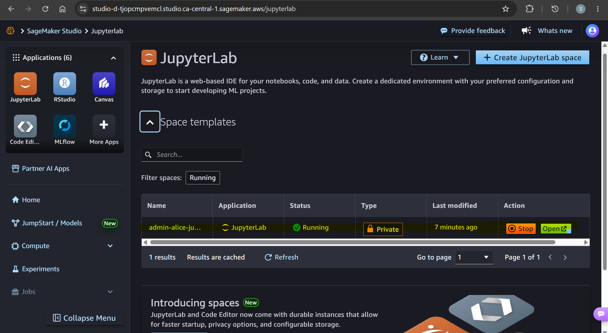
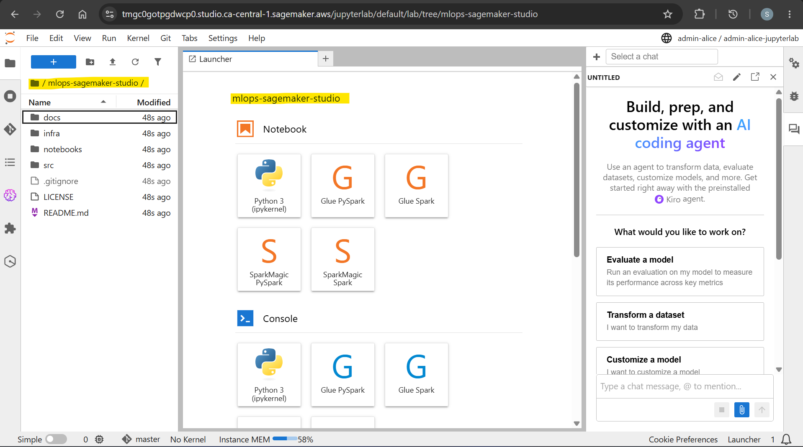
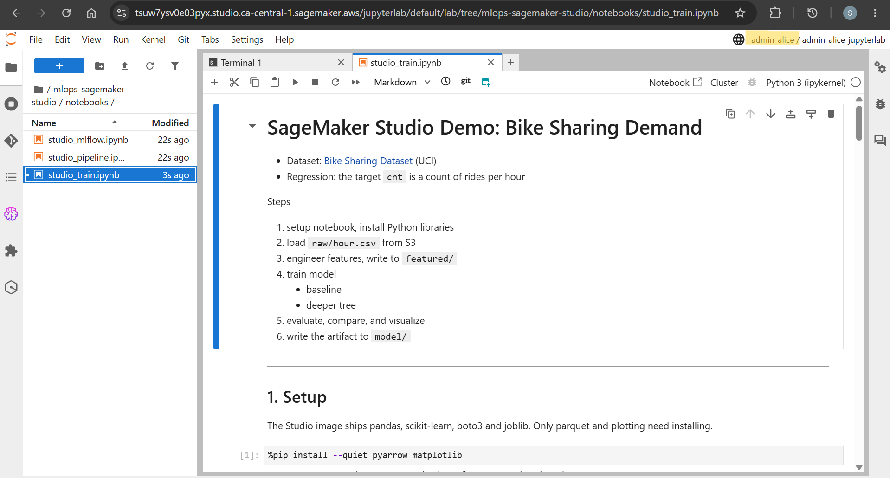
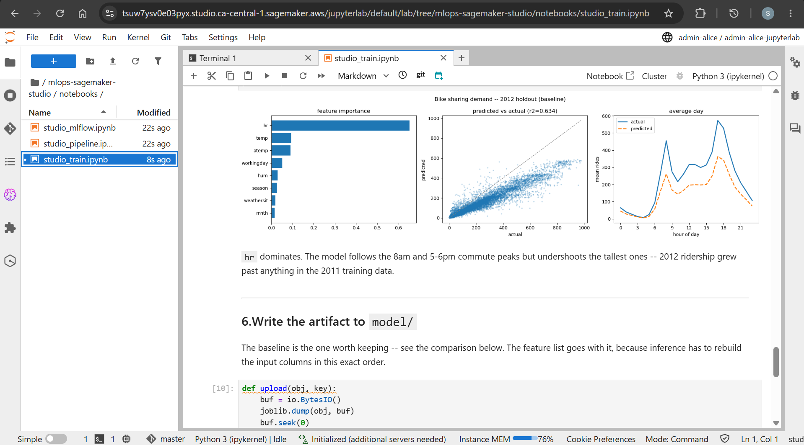
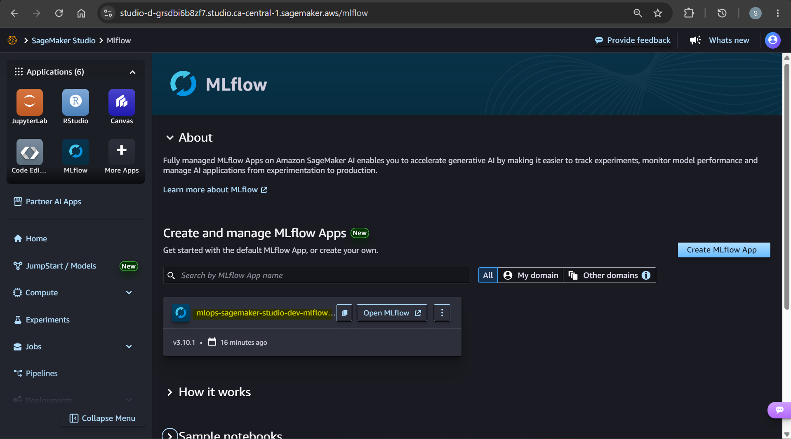
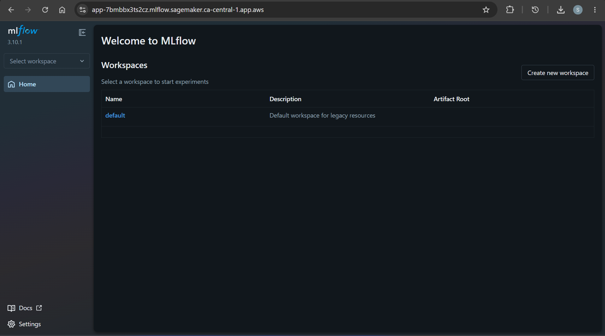

# mlops-sagemaker-studio

A side project that explores key features of sagemaker studio.

---

## Sagamaker Studio

- `Amazon SageMaker Studio`
  - a web-based, unified `integrated development environment (IDE)` designed for complete, end-to-end machine learning and data workflows.
  - provides access to tools like `JupyterLab`, `Code Editor (VS Code Open Source)`, and `RStudio` to build, train, tune, and deploy AI models.

---

## Feature: JupyterLab

- `JupyterLab feature`
  - A managed Jupyter notebooks instance within Sagamaker Studio.

- JupyterLab UI
  

- Notebook UI
  

- Training with classic bike sharing dataset
  

  

---

## Feature: MLFlow

- `MLflow feature`
  - A fully managed **`MLflow` tracking servers** to track experiments, log metrics, and handle model governance directly from the workspace.

- MLflow UI
  
  

- Experiments Tracking

---

## Feature: Pipeline

create pipeline with Sagameker Python SDK

---

## Documentation

- [IaC with Terraform](./docs/01-infra.md)
- [Jupyter Notebook](./docs/02-notebook.md)
- [MLflow](./docs/03-mlflow.md)
- [Pipeline](./docs/04-pipeline.md)
