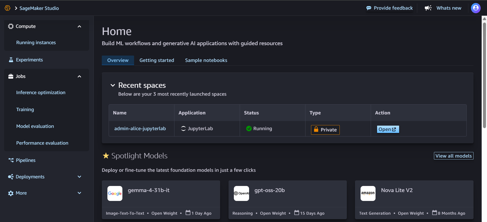
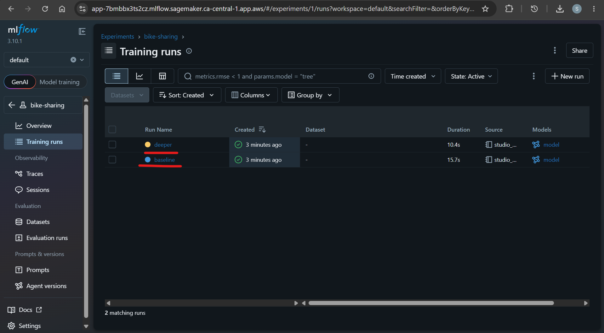
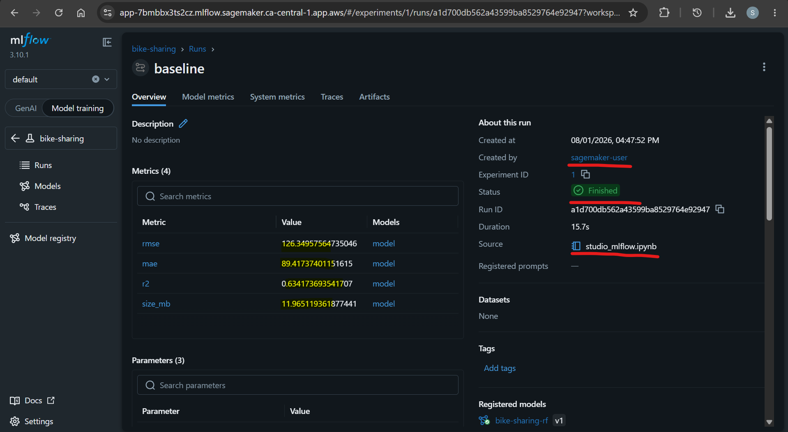
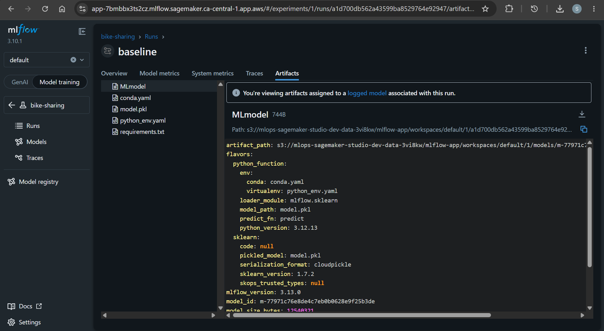
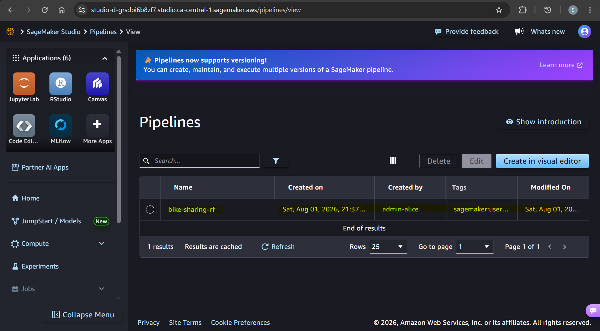
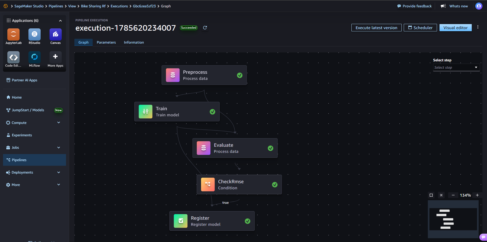
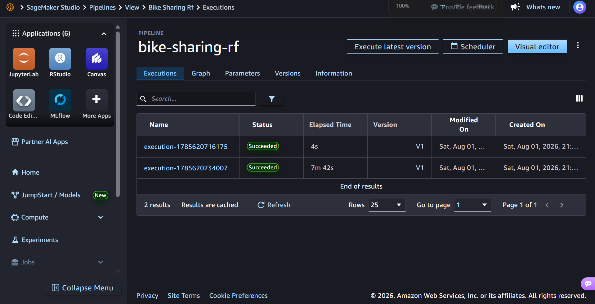
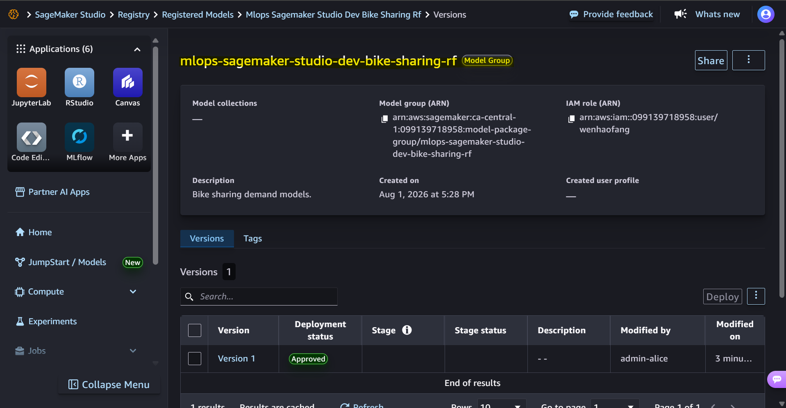
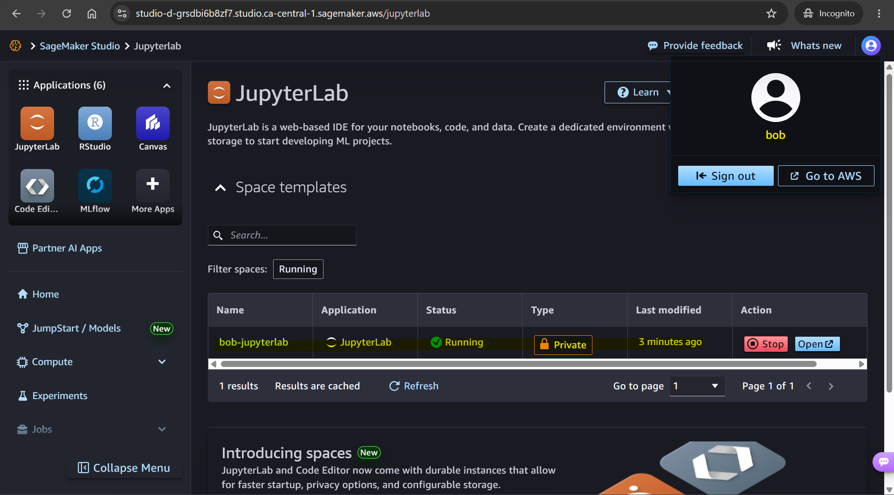
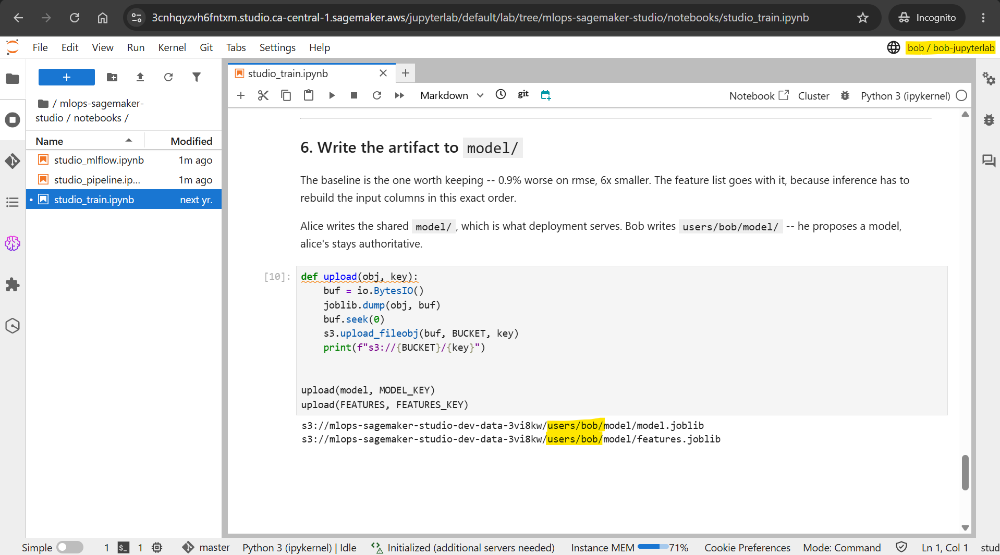

# Amazon SageMaker Studio Demo

A side project that explores the key features of Amazon SageMaker Studio.

- [Amazon SageMaker Studio Demo](#amazon-sagemaker-studio-demo)
  - [Sagamaker Studio](#sagamaker-studio)
  - [Feature: JupyterLab](#feature-jupyterlab)
  - [Feature: MLFlow](#feature-mlflow)
  - [Feature: Pipeline](#feature-pipeline)
  - [Feature: Collaboration](#feature-collaboration)
  - [Documentation](#documentation)

---

## Sagamaker Studio

- `Amazon SageMaker Studio`
  - A web-based, unified `integrated development environment (IDE)` designed for complete, end-to-end machine learning and data workflows.
  - Provides access to tools such as `JupyterLab`, `Code Editor (VS Code Open Source)`, and `RStudio` to build, train, tune, and deploy AI models.

---

## Feature: JupyterLab

- `JupyterLab feature`
  - A managed Jupyter notebook instance within SageMaker Studio.

- JupyterLab UI
  

- Notebook UI
  

- Training with the classic bike sharing dataset
  

  

---

## Feature: MLFlow

- `MLflow feature`
  - Fully managed **`MLflow` tracking servers** to track experiments, log metrics, and handle model governance directly from the workspace.

- MLflow UI
  
  

- Experiment Tracking

  

  

  

---

## Feature: Pipeline

- `Pipeline feature`
  - Create a pipeline with the SageMaker Python SDK.

- Pipeline UI

  

  

- Execution
  

- Registered Model
  

---

## Feature: Collaboration

- Onboard a data scientist named "Bob".

- Log in as "Bob"
  

- Train and save a model as "Bob"
  

---

## Documentation

- [IaC with Terraform](./docs/01-infra.md)
- [Jupyter Notebook](./docs/02-notebook.md)
- [MLflow](./docs/03-mlflow.md)
- [Pipeline](./docs/04-pipeline.md)
- [Collaboration](./docs/05-collaboration.md)
