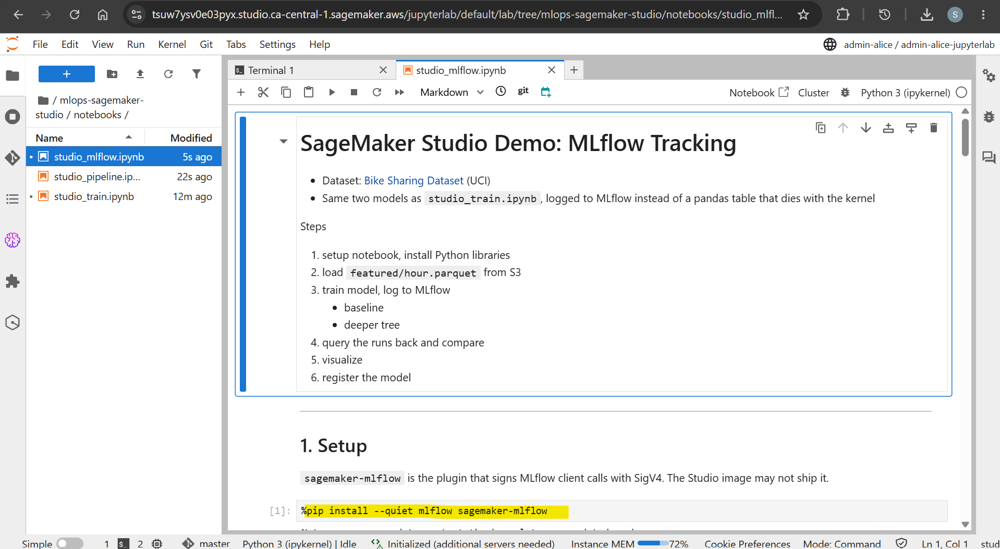
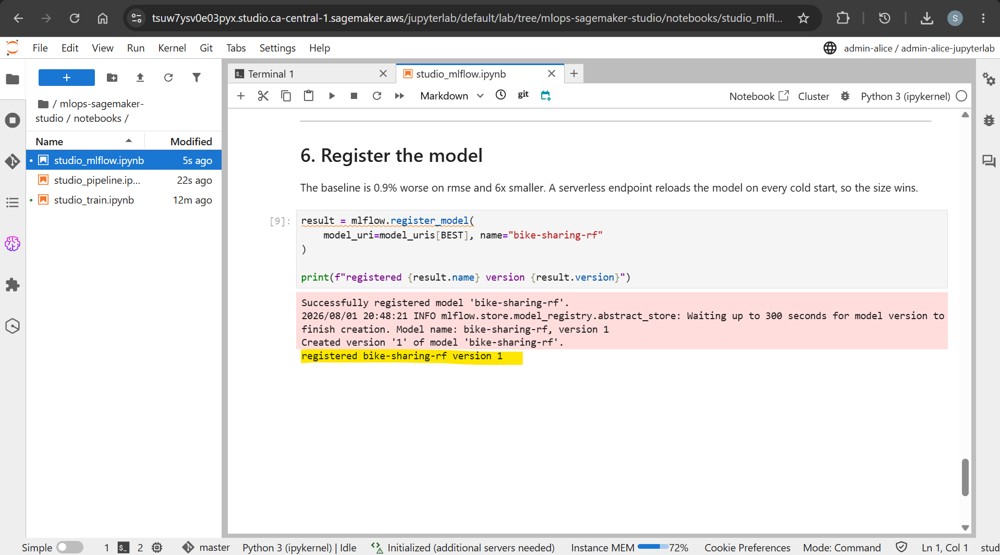

# Amazon SageMaker Studio Demo - MLflow

[Back](../README.md)

- [Amazon SageMaker Studio Demo - MLflow](#amazon-sagemaker-studio-demo---mlflow)
  - [MLflow](#mlflow)
    - [Capture](#capture)

---

## MLflow

```sh
terraform -chdir=infra output -raw mlflow_ui_command
# aws sagemaker create-presigned-mlflow-app-url --arn arn:aws:sagemaker:ca-central-1:099139718958:mlflow-app/app-7BMBBX3TS2CZ --region ca-central-1 --query AuthorizedUrl --output text

aws sagemaker create-presigned-mlflow-app-url --arn arn:aws:sagemaker:ca-central-1:099139718958:mlflow-app/app-7BMBBX3TS2CZ --region ca-central-1 --query AuthorizedUrl --output text

aws s3 ls "s3://mlops-sagemaker-studio-dev-data-3vi8kw/raw/"
# 2026-08-01 15:23:15          0
# 2026-08-01 15:31:14      57569 day.csv
# 2026-08-01 15:31:14    1156736 hour.csv
```

---

### Capture

- UI


- Training with notebook





- Tracking


---
